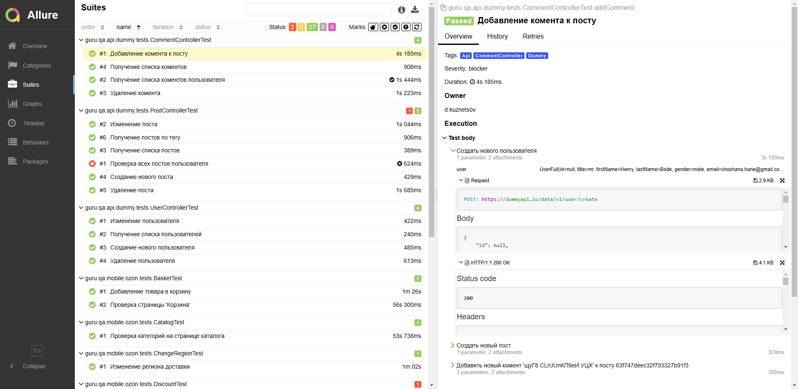

# Дипломный проект по автоматизации тестирования web, api и mobile платформ

## 	Содержание

> ➠ [Общая информация о проекте](#общая-информация-о-проекте)
>
> ➠ [Запуск тестов из терминала](#запуск-тестов-из-терминала)
>
> ➠ [Запуск тестов в Jenkins](#-удаленный-запуск-тестов-в-Jenkins)
>
> ➠ [Отчет о результатах тестирования в Allure Report](#-главная-страница-allure-отчета)
>
> ➠ [Tests as documentation в Allure Test Ops](#-тест-кейсы-в-allure-test-ops)
>
> ➠ [Уведомления в Telegram с использованием бота](#-уведомления-в-telegram-с-использованием-бота)
> 
> ➠ [Web приложение Saucedemo](#web-приложение-saucedemo)
>
> ➠ [Покрытый функционал web приложения Saucedemo](#покрытый-функционал-web-приложения-saucedemo)
>
> ➠ [Технологический стек UI](#технологический-стек-ui)
> 
> ➠ [Пример запуска теста в Selenoid](#-пример-запуска-теста-в-selenoid)
> 
> ➠ [Api сервис Dummy](#api-сервис-dummy)
> 
> ➠ [Покрытый функционал api сервиса Dummy](#покрытый-функционал-api-сервиса-dummy)
> 
> ➠ [Технологический стек API](#технологический-стек-api)
> 
> ➠ [Мобильное приложение Ozon](#мобильное-приложение-ozon)
>
> ➠ [Покрытый функционал мобильного приложения Ozon](#покрытый-функционал-мобильного-приложения-ozon)
>
> ➠ [Технологический стек Mobile](#технологический-стек-mobile)
>
> ➠ [Пример запуска теста в Browserstack](#-пример-запуска-теста-в-browserstack)
 
##  Общая информация о проекте

### Запуск тестов из терминала

### Локальный запуск тестов

#### Локальный запуск тестов с использованием параметров из property файла

```
gradle clean test -Denv={имя property файла в папке test.resources}
```

#### Локальный запуск тестов с использованием параметров из property файла test

```
gradle clean test
```

#### Описание параметров для запуска тестов

> -Dtag <code>тэг тестов для запуска</code>
>
> -Dthreads <code>количество потоков для запуска тестов</code>
>
> -DwebBrowserName <code>название браузера</code>
>
> -DwebBrowserVersion <code>версия браузера</code>
>
> -webBaseUrl <code>url стенда фронта</code>
>
> -DwebBrowserSize <code>разрешение браузера</code>
>
> -DwebPageLoadTimeout <code>таймаут загрузки страницы</code>
>
> -DwebTimeout <code>таймаут ожидания загрузки элемента страницы</code>
>
> -DwebIsHeadless <code>запуск браузера в обычном или headless режиме</code>
>
> -DwebIsRemote <code>запуск тестов локально или через remote сервис</code>
>
> -DwebRemoteUrl <code>url remote сервиса</code>
>
> -DmobilePlatform <code>выбор платформы для запуска мобильных тестов(локально или в Browserstack)</code>
> 
> -DbuildName <code>имя билда, используется для опознования запущенного билда в browserstack</code>
> 
> -DandroidVersion <code>версия android для browserstack</code>
> 
> -DandroidDevice <code>имя android девайса для browserstack</code>
> 
> -DandroidApp <code>идентификатор приложения, загруженного в browserstack</code>

### Удаленный запуск тестов

#### Удалённый запуск через передачу параметров

```
gradle clean test 
-Denv=test 
-Dtag= 
-Dthreads= 
-DwebIsRemote=true 
-DwebRemoteUrl=https://selenoid.cloud 
-DwebBaseUrl=https://www.saucedemo.com 
-DwebBrowserSize=1920x1080 
-DwebBrowserName=chrome 
-DwebBrowserVersion=100.0 
-DmobilePlatform=browserstack 
"-DandroidDevice=Google Pixel 3" 
-DandroidVersion=9.0 
-DbuildName=C16_Mamalazer_24
```

#### Удалённый запуск через заранее подготовленный property файл

> Создаём property файл с необходимыми параметрами и кладём его в <code>test.resources</code>
>
> Запускаем тесты, используя созданный property файл
>
> <code>gradle clean test -Denv={имя файла}</code>

##### Пример файла
```
browserName=chrome
browserVersion=108
baseUrl=https://www.google.com
browserSize=1920x1080
pageLoadTimeout=10000
timeout=10000
headless=false
isRemote=true
remoteUrl=https://selenoid.autotests.cloud
```

##  Удаленный запуск тестов в Jenkins

> Для запуска тестов используется параметризированная сборка

<p align="center">

</p>

##  Главная страница allure отчета

<p align="center">

</p>

###  Группировка тестов по проверяемому функционалу

<p align="center">

</p>

###  Основной дашборд

<p align="center">

</p>

###  Тест кейсы в Allure Test Ops

<p align="center">

</p>

##  Уведомления в Telegram с использованием бота

> После завершения сборки специальный бот, созданный в <code>Telegram</code>, автоматически обрабатывает и отправляет сообщение с отчетом о прогоне.
>
> Информация по настройке и использованию бота <code>https://github.com/qa-guru/allure-notifications</code>

<p align="center">

</p>

##  Web приложение Saucedemo

###  Покрытый функционал web приложения Saucedemo

> Разработаны автотесты на <code>UI</code>.
### UI

- [x] Авторизация в веб приложении
- [x] Проверка сортировки товаров
- [x] Добавление товаров в корзину
- [x] Оформление и оплата заказа

### Технологический стек UI

<p align="center">


</p>

### В данном подпроекте автотесты написаны на <code>Java</code> с использованием <code>Selenide</code> для UI-тестов.
>
> <code>Selenoid</code> выполняет запуск браузеров в контейнерах <code>Docker</code>.
>
> <code>Allure Report</code> формирует отчет о запуске тестов.
>
> Для автоматизированной сборки проекта используется <code>Gradle</code>.
>
> В качестве библиотеки для модульного тестирования используется <code>JUnit 5</code>.
>
> <code>Jenkins</code> выполняет запуск тестов.
> 
> После завершения прогона отправляются уведомления с помощью бота в <code>Telegram</code>.

##  Пример запуска теста в Selenoid

> К каждому тесту в отчете прилагается видео. Одно из таких видео представлено ниже.

<p align="center">

</p>

##  Api сервис Dummy

###  Покрытый функционал api сервиса Dummy

> Разработаны автотесты на <code>Api сервис</code>.
### Api

- [x] Получение списка пользователей
- [x] Создание нового пользователя
- [x] Изменение пользователя
- [x] Удаление пользователя
- [x] Получение списка постов
- [x] Создание нового поста
- [x] Изменение поста
- [x] Удаление поста
- [x] Проверка всех постов пользователя
- [x] Получение постов по тегу
- [x] Получение списка коментов
- [x] Добавление комента к посту
- [x] Получение списка коментов пользователя
- [x] Удаление комента

### Технологический стек API

<p align="center">


</p>

### В данном подпроекте автотесты написаны на <code>Java</code> с использованием <code>Rest Assured</code> для Api-тестов.
>
> <code>Rest Assured</code> выполняет роль обёртки над http клиентом.
>
> <code>Allure Report</code> формирует отчет о запуске тестов.
>
> Для автоматизированной сборки проекта используется <code>Gradle</code>.
>
> В качестве библиотеки для модульного тестирования используется <code>JUnit 5</code>.
>
> <code>Jenkins</code> выполняет запуск тестов.
>
> После завершения прогона отправляются уведомления с помощью бота в <code>Telegram</code>.

## Мобильное приложение Ozon

### Покрытый функционал мобильного приложения Ozon

> Разработаны автотесты для мобильного приложения Ozon.

- [x] Проверка страницы 'Корзина'
- [x] Добавление товара в корзину
- [x] Проверка категорий на странице каталога
- [x] Изменение региона доставки
- [x] Проверка страницы 'Скидки'
- [x] Поиск товара и добавление в корзину

### Технологический стек Mobile

<p align="center">


</p>

### В данном подпроекте автотесты написаны на <code>Java</code> с использованием <code>Selenide и Appium</code>.
>
> <code>Selenide и Appium</code> используются для управления мобильным устройством с помощью веб драйвера.
>
> Тесты можно запускать как локально(с помощью Android studio и эмулятора мобильного устройства), так и с помощью сервиса Browserstack, предоставляющего доступ к ферме с реальными мобильными устройствами
> 
> <code>Allure Report</code> формирует отчет о запуске тестов.
>
> Для автоматизированной сборки проекта используется <code>Gradle</code>.
>
> В качестве библиотеки для модульного тестирования используется <code>JUnit 5</code>.
>
> <code>Jenkins</code> выполняет запуск тестов.
>
> После завершения прогона отправляются уведомления с помощью бота в <code>Telegram</code>.

##  Пример запуска теста в Browserstack

> К каждому тесту в отчете прилагается видео и различные логи. Одно из таких видео представлено ниже.

<p align="center">

</p>